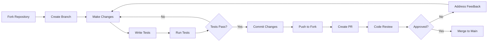

# 🤝 Contributing to Motion Amplification Pro

<div align="center">


**Join our mission to reveal the invisible world through motion amplification!**

*Every contribution, no matter how small, makes a difference*

</div>

---

## 📋 **Table of Contents**

1. [🚀 Quick Start](#-quick-start)
2. [🛠️ Development Environment](#️-development-environment)
3. [🎯 Contribution Areas](#-contribution-areas)
4. [📝 Coding Standards](#-coding-standards)
5. [🧪 Testing Guidelines](#-testing-guidelines)
6. [📋 Pull Request Process](#-pull-request-process)
7. [🐛 Bug Reports](#-bug-reports)
8. [💡 Feature Requests](#-feature-requests)
9. [👥 Community Guidelines](#-community-guidelines)
10. [🎓 Learning Resources](#-learning-resources)

---

## 🚀 **Quick Start**

### 🔥 **Ready to Contribute?**

```bash
# 1. Fork the repository on GitHub
# Click the "Fork" button at https://github.com/yourusername/motion-amplification-tool

# 2. Clone your fork
git clone https://github.com/YOUR_USERNAME/motion-amplification-tool.git
cd motion-amplification-tool

# 3. Set up upstream remote
git remote add upstream https://github.com/yourusername/motion-amplification-tool.git

# 4. Create your feature branch
git checkout -b feature/amazing-new-feature

# 5. Make your changes and commit
git add .
git commit -m "feat: add amazing new feature"

# 6. Push to your fork
git push origin feature/amazing-new-feature

# 7. Create a Pull Request on GitHub
```

### ⚡ **First-Time Contributors**

New to open source? No problem! Start with these **good first issues**:

- 🐛 **Fix typos** in documentation
- 🎨 **Improve UI/UX** elements
- 📝 **Add code comments** for clarity
- 🧪 **Write tests** for existing features
- 🌐 **Improve browser compatibility**

Look for issues labeled:  

---

## 🛠️ **Development Environment**

### 📋 **Prerequisites**

| **Tool** | **Version** | **Purpose** | **Installation** |
|----------|-------------|-------------|------------------|
| **Node.js** | 18.0+ | Development tools | [nodejs.org](https://nodejs.org/) |
| **Git** | 2.25+ | Version control | [git-scm.com](https://git-scm.com/) |
| **VS Code** | Latest | Recommended editor | [code.visualstudio.com](https://code.visualstudio.com/) |
| **Modern Browser** | Latest | Testing | Chrome/Firefox/Safari/Edge |

### 🔧 **Local Development Setup**

```bash
# Install development dependencies
npm install

# Install recommended VS Code extensions
code --install-extension ms-vscode.vscode-typescript-next
code --install-extension bradlc.vscode-tailwindcss
code --install-extension esbenp.prettier-vscode
code --install-extension dbaeumer.vscode-eslint

# Start development server
npm run dev
# OR use any static server:
python -m http.server 8000
npx serve .
php -S localhost:8000
```

### 📁 **Project Structure**

```
motion-amplification-tool/
├── 📄 index.html                    # Main application entry point
├── 📁 css/
│   └── 🎨 style.css                # Modern glassmorphism styling
├── 📁 js/
│   ├── ⚡ motion-amp-pro.js         # Core application logic
│   ├── 🎮 webgl-processor.js        # GPU acceleration engine
│   ├── 🔧 motion-worker.js          # Background processing worker
│   ├── ⚙️ config.js                 # Configuration management
│   └── 📊 performance-analytics.js  # Performance monitoring
├── 📁 .github/
│   └── 📁 workflows/
│       └── 🚀 deploy-and-test.yml   # CI/CD pipeline
├── 📁 docs/
│   ├── 📖 user-guide.md             # Complete user documentation
│   ├── 🔌 api-reference.md          # Developer API docs
│   └── 📚 examples/                 # Code examples
├── 📄 manifest.json                 # PWA configuration
├── 🔒 sw.js                         # Service worker for offline support
├── 📄 offline.html                  # Offline fallback page
├── 📝 README.md                     # Project overview
├── 🤝 CONTRIBUTING.md               # This file
├── 🔒 SECURITY.md                   # Security policy
├── 📝 CHANGELOG.md                  # Version history
└── ⚖️ LICENSE                       # MIT license
```

### 🌐 **Development URLs**

- **Local App**: `http://localhost:8000`
- **Live Demo**: `https://yourusername.github.io/motion-amplification-tool`
- **Documentation**: `http://localhost:8000/docs/`
- **API Reference**: `http://localhost:8000/docs/api-reference.md`

---

## 🎯 **Contribution Areas**

### 🔥 **High Priority (Need Your Help!)**

| **Area** | **Difficulty** | **Impact** | **Skills Needed** |
|----------|----------------|------------|-------------------|
| 🤖 **AI Enhancement** | Hard | 🌟🌟🌟🌟🌟 | TensorFlow.js, Machine Learning |
| ☁️ **Cloud Processing** | Hard | 🌟🌟🌟🌟🌟 | Node.js, WebRTC, Server Architecture |
| 📱 **Mobile Apps** | Medium | 🌟🌟🌟🌟 | React Native, Flutter, Swift, Kotlin |
| 🎮 **WebGL Optimization** | Hard | 🌟🌟🌟🌟 | GLSL, Graphics Programming |
| 🔊 **Audio Integration** | Medium | 🌟🌟🌟 | Web Audio API, Signal Processing |

### ⚡ **Medium Priority**

| **Area** | **Difficulty** | **Impact** | **Skills Needed** |
|----------|----------------|------------|-------------------|
| 🎨 **UI/UX Improvements** | Easy | 🌟🌟🌟 | CSS, Design, Accessibility |
| 📊 **Advanced Analytics** | Medium | 🌟🌟🌟 | JavaScript, Data Visualization |
| 🌐 **Internationalization** | Easy | 🌟🌟🌟 | JavaScript, Multiple Languages |
| 🔧 **Performance Optimization** | Medium | 🌟🌟🌟🌟 | JavaScript, Profiling |
| 📝 **Documentation** | Easy | 🌟🌟 | Writing, Markdown, Examples |

### 🎁 **Good First Issues**

Perfect for newcomers! Look for these labels:

```yaml
🟢 good-first-issue:
  - Fix typos in documentation
  - Add missing alt text for images
  - Improve error messages
  - Add code comments
  - Update dependencies

🔵 help-wanted:
  - Browser compatibility fixes
  - Mobile responsiveness
  - Accessibility improvements
  - Test coverage expansion
  - Performance optimizations

🟡 documentation:
  - API documentation
  - User guides
  - Code examples
  - Video tutorials
  - FAQ sections
```

### 🚀 **Advanced Contributions**

For experienced developers:

```yaml
🔴 expert-level:
  - WebGL shader optimization
  - Advanced algorithm implementation
  - Real-time processing improvements
  - Memory management optimization
  - Security enhancements

🟠 research:
  - New motion amplification algorithms
  - Academic paper implementations
  - Performance benchmarking
  - Cross-platform compatibility
  - Cutting-edge web technologies
```

---

## 📝 **Coding Standards**

### 🎨 **Code Style**

We use **Prettier** and **ESLint** for consistent formatting:

```bash
# Install tools
npm install -g prettier eslint

# Format code
npm run format

# Lint code
npm run lint

# Fix linting issues
npm run lint:fix
```

### 📋 **JavaScript Guidelines**

```javascript
// ✅ GOOD: Modern ES6+ syntax
const processVideo = async (videoFile, parameters) => {
  try {
    const frames = await extractFrames(videoFile);
    return await amplifyMotion(frames, parameters);
  } catch (error) {
    console.error('Processing failed:', error.message);
    throw new ProcessingError('Video processing failed', error);
  }
};

// ✅ GOOD: Descriptive naming
const AMPLIFICATION_LIMITS = {
  MIN: 1,
  MAX: 100,
  DEFAULT: 15
};

// ✅ GOOD: Comprehensive error handling
class MotionAmplificationError extends Error {
  constructor(message, originalError = null) {
    super(message);
    this.name = 'MotionAmplificationError';
    this.originalError = originalError;
    this.timestamp = Date.now();
  }
}

// ❌ AVOID: Callback hell
loadVideo(file, function(video) {
  processVideo(video, function(result) {
    displayResult(result, function(success) {
      // This is hard to read and maintain
    });
  });
});

// ✅ BETTER: Promise chains or async/await
const result = await loadVideo(file)
  .then(processVideo)
  .then(displayResult);
```

### 🎨 **CSS Guidelines**

```css
/* ✅ GOOD: BEM methodology */
.motion-amplifier__control-panel {
  display: grid;
  grid-template-columns: repeat(auto-fit, minmax(250px, 1fr));
  gap: 1rem;
}

.motion-amplifier__slider {
  width: 100%;
  transition: all 0.3s ease;
}

.motion-amplifier__slider--disabled {
  opacity: 0.5;
  pointer-events: none;
}

/* ✅ GOOD: CSS custom properties */
:root {
  --primary-color: #667eea;
  --secondary-color: #764ba2;
  --accent-color: #4CAF50;
  --glass-bg: rgba(255, 255, 255, 0.1);
  --border-radius: 12px;
  --transition-speed: 0.3s;
}

/* ✅ GOOD: Mobile-first responsive design */
.video-container {
  display: flex;
  flex-direction: column;
  gap: 1rem;
}

@media (min-width: 768px) {
  .video-container {
    flex-direction: row;
    gap: 2rem;
  }
}
```

### 📄 **HTML Guidelines**

```html
<!-- ✅ GOOD: Semantic HTML with accessibility -->
<main class="motion-amplifier" role="main">
  <section class="upload-section" aria-labelledby="upload-heading">
    <h2 id="upload-heading">Upload Video</h2>
    
    <div class="upload-zone" 
         role="button" 
         tabindex="0"
         aria-label="Drop video file here or click to select"
         aria-describedby="upload-instructions">
      
      <input type="file" 
             id="video-input"
             accept="video/*"
             aria-describedby="supported-formats">
      
      <p id="upload-instructions">
        Drag and drop your video file here
      </p>
      
      <small id="supported-formats">
        Supports MP4, WebM, AVI, MOV formats
      </small>
    </div>
  </section>
</main>

<!-- ✅ GOOD: Progressive enhancement -->
<noscript>
  <div class="no-javascript-warning">
    <h2>JavaScript Required</h2>
    <p>Motion Amplification Pro requires JavaScript to function.</p>
    <p>Please enable JavaScript in your browser and reload the page.</p>
  </div>
</noscript>
```

### 🔧 **Configuration Files**

Create these configuration files in your project:

**.eslintrc.js**
```javascript
module.exports = {
  env: {
    browser: true,
    es2021: true,
    worker: true,
    serviceworker: true
  },
  extends: [
    'eslint:recommended',
    '@eslint/js/recommended'
  ],
  parserOptions: {
    ecmaVersion: 2021,
    sourceType: 'module'
  },
  rules: {
    'no-unused-vars': 'warn',
    'no-console': 'off',
    'prefer-const': 'error',
    'no-var': 'error',
    'arrow-spacing': 'error',
    'comma-dangle': ['error', 'only-multiline'],
    'quotes': ['error', 'single'],
    'semi': ['error', 'always']
  },
  globals: {
    THREE: 'readonly',
    WebGLRenderingContext: 'readonly',
    ImageData: 'readonly',
    OffscreenCanvas: 'readonly'
  }
};
```

**.prettierrc**
```json
{
  "semi": true,
  "trailingComma": "es5",
  "singleQuote": true,
  "printWidth": 100,
  "tabWidth": 2,
  "useTabs": false,
  "bracketSpacing": true,
  "arrowParens": "always",
  "endOfLine": "lf"
}
```

---

## 🧪 **Testing Guidelines**

### 📋 **Testing Checklist**

Before submitting any contribution:

#### **🌐 Browser Compatibility**
- [ ] **Chrome** (latest 2 versions)
- [ ] **Firefox** (latest 2 versions)  
- [ ] **Safari** (latest 2 versions)
- [ ] **Edge** (latest 2 versions)
- [ ] **Mobile browsers** (iOS Safari, Chrome Mobile)

#### **📱 Device Testing**
- [ ] **Desktop** (1920x1080, 1366x768)
- [ ] **Tablet** (iPad, Android tablet)
- [ ] **Mobile** (iPhone, Android phone)
- [ ] **High DPI** displays

#### **⚡ Performance Testing**
- [ ] **Large videos** (>100MB, >1080p)
- [ ] **Long processing** sessions
- [ ] **Memory usage** monitoring
- [ ] **GPU performance** (if applicable)
- [ ] **Network conditions** (slow 3G, offline)

#### **♿ Accessibility Testing**
- [ ] **Keyboard navigation** only
- [ ] **Screen reader** compatibility
- [ ] **High contrast** mode
- [ ] **Color blindness** simulation
- [ ] **Focus indicators** visible

### 🧪 **Automated Testing**

```bash
# Run all tests
npm test

# Run specific test suites
npm run test:unit          # Unit tests
npm run test:integration   # Integration tests
npm run test:e2e          # End-to-end tests
npm run test:accessibility # Accessibility tests
npm run test:performance  # Performance tests

# Generate coverage report
npm run test:coverage

# Run tests in watch mode
npm run test:watch
```

### 📊 **Performance Benchmarks**

Your changes should maintain or improve these benchmarks:

```yaml
Performance Targets:
  Page Load: < 3 seconds
  First Contentful Paint: < 1.5 seconds
  Video Processing: > 10 fps (CPU mode)
  Video Processing: > 30 fps (GPU mode)
  Memory Usage: < 500MB (typical usage)
  Bundle Size: < 2MB (gzipped)
```

### 🎥 **Test Videos**

Use these standardized test videos:

```yaml
Test Video Library:
  heartbeat_sample.mp4:
    Duration: 30 seconds
    Resolution: 1280x720
    Content: Person sitting still
    Expected: Visible pulse amplification

  breathing_sample.mp4:
    Duration: 45 seconds  
    Resolution: 1920x1080
    Content: Chest/torso view
    Expected: Breathing motion visible

  vibration_sample.mp4:
    Duration: 15 seconds
    Resolution: 1280x720
    Content: Machinery or structure
    Expected: Mechanical vibrations revealed

  micro_sample.mp4:
    Duration: 20 seconds
    Resolution: 1920x1080
    Content: Close-up face
    Expected: Micro-expressions amplified
```

---

## 📋 **Pull Request Process**

### 🚀 **PR Workflow**



### 📝 **PR Template**

```markdown
## 🎯 **Description**
Brief description of what this PR accomplishes.

## 🔧 **Type of Change**
- [ ] 🐛 Bug fix (non-breaking change that fixes an issue)
- [ ] ✨ New feature (non-breaking change that adds functionality)
- [ ] 💥 Breaking change (fix or feature that would cause existing functionality to not work as expected)
- [ ] 📚 Documentation update
- [ ] 🎨 Style/UI change
- [ ] ⚡ Performance improvement
- [ ] 🔒 Security fix

## 🧪 **Testing**
- [ ] ✅ Unit tests pass
- [ ] ✅ Integration tests pass  
- [ ] ✅ E2E tests pass
- [ ] ✅ Manual testing completed
- [ ] ✅ Browser compatibility verified
- [ ] ✅ Mobile responsiveness checked
- [ ] ✅ Accessibility tested
- [ ] ✅ Performance benchmarks met

## 📱 **Browser Testing**
- [ ] ✅ Chrome (latest)
- [ ] ✅ Firefox (latest)
- [ ] ✅ Safari (latest)
- [ ] ✅ Edge (latest)
- [ ] ✅ Mobile Safari
- [ ] ✅ Chrome Mobile

## 📋 **Checklist**
- [ ] ✅ My code follows the style guidelines of this project
- [ ] ✅ I have performed a self-review of my own code
- [ ] ✅ I have commented my code, particularly in hard-to-understand areas
- [ ] ✅ I have made corresponding changes to the documentation
- [ ] ✅ My changes generate no new warnings
- [ ] ✅ I have added tests that prove my fix is effective or that my feature works
- [ ] ✅ New and existing unit tests pass locally with my changes

## 📸 **Screenshots** (if applicable)
Before | After
-------|------
 | 

## 🔗 **Related Issues**
Fixes #123
Closes #456
Related to #789

## 📝 **Additional Notes**
Any additional information, considerations, or notes for reviewers.
```

### 🔍 **Code Review Process**

1. **🤖 Automated Checks**
   - CI/CD pipeline runs
   - Tests execute automatically
   - Code quality analysis
   - Security scanning

2. **👥 Human Review**
   - Code style and best practices
   - Logic and implementation review
   - Performance considerations
   - Security implications

3. **✅ Approval Requirements**
   - Minimum 2 approving reviews
   - All tests passing
   - No merge conflicts
   - Documentation updated

### 💡 **Review Guidelines**

**For Reviewers:**
- Be constructive and helpful
- Explain the "why" behind suggestions
- Acknowledge good work
- Test the changes locally when possible

**For Contributors:**
- Respond to feedback promptly
- Ask questions if unclear
- Make requested changes
- Thank reviewers for their time

---

## 🐛 **Bug Reports**

### 🚨 **How to Report Bugs**

1. **🔍 Search First**: Check if the issue already exists
2. **📋 Use Template**: Fill out the bug report template completely
3. **🎥 Provide Evidence**: Screenshots, videos, console logs
4. **🔬 Include Details**: Reproduction steps, environment info

### 📝 **Bug Report Template**

```markdown
---
name: 🐛 Bug Report
about: Create a report to help us improve
title: '[BUG] Brief description'
labels: bug, needs-triage
assignees: ''
---

## 🐛 **Bug Description**
A clear and concise description of what the bug is.

## 🔄 **Steps to Reproduce**
1. Go to '...'
2. Click on '....'
3. Scroll down to '....'
4. See error

## ✅ **Expected Behavior**
A clear and concise description of what you expected to happen.

## ❌ **Actual Behavior**
A clear and concise description of what actually happened.

## 📸 **Screenshots/Videos**
If applicable, add screenshots or videos to help explain your problem.

## 🌐 **Environment**
- **Browser**: [e.g. Chrome 120.0.0.0]
- **OS**: [e.g. Windows 11, macOS 14.1, Ubuntu 22.04]
- **Device**: [e.g. Desktop, iPhone 15, Samsung Galaxy S23]
- **Screen Resolution**: [e.g. 1920x1080, 375x667]
- **App Version**: [e.g. 2.0.0]

## 📄 **Video File Details** (if applicable)
- **Format**: [e.g. MP4, WebM]
- **Resolution**: [e.g. 1920x1080]
- **Duration**: [e.g. 30 seconds]
- **File Size**: [e.g. 25MB]
- **Frame Rate**: [e.g. 30fps]

## 🔍 **Console Errors** (if any)
```javascript
// Paste any console errors here
```

## 📋 **Additional Context**
Add any other context about the problem here.

## 🏷️ **Priority**
- [ ] 🚨 Critical (app unusable)
- [ ] 🔴 High (major feature broken)
- [ ] 🟡 Medium (minor feature affected)
- [ ] 🟢 Low (cosmetic issue)
```

### 🚨 **Critical Bug Process**

For **critical bugs** that make the app unusable:

1. **🚨 Immediate Response**: Tag with `critical` label
2. **📞 Emergency Contact**: Notify maintainers immediately
3. **🔧 Hotfix Branch**: Create emergency fix branch
4. **⚡ Fast Track**: Skip normal review process if needed
5. **📢 User Communication**: Update status page and notify users

---

## 💡 **Feature Requests**

### ✨ **How to Request Features**

1. **💭 Check Roadmap**: See if it's already planned
2. **🔍 Search Issues**: Avoid duplicates
3. **📋 Use Template**: Complete feature request template
4. **🗳️ Community Vote**: Get community feedback

### 📝 **Feature Request Template**

```markdown
---
name: ✨ Feature Request
about: Suggest an idea for Motion Amplification Pro
title: '[FEATURE] Brief description'
labels: enhancement, needs-discussion
assignees: ''
---

## 🎯 **Feature Description**
A clear and concise description of the feature you'd like to see.

## 💪 **Problem/Use Case**
What problem does this feature solve? Who would benefit from it?

## 💡 **Proposed Solution**
Describe how you envision this feature working.

## 🔄 **Alternatives Considered**
Alternative solutions or features you've considered.

## 🎨 **Design Ideas** (optional)
Any mockups, wireframes, or design ideas.

## 📋 **Implementation Notes** (optional)
Technical considerations or implementation ideas.

## 🏷️ **Priority**
- [ ] 🔥 Must have (critical for users)
- [ ] 🎯 Should have (important improvement)  
- [ ] 💡 Could have (nice to have)
- [ ] 🌟 Won't have (future consideration)

## 📊 **Success Metrics**
How would we measure the success of this feature?

## 🤝 **Contribution**
- [ ] I'd like to work on this feature
- [ ] I can provide testing/feedback
- [ ] I can provide design input
- [ ] I can help with documentation
```

### 🗳️ **Feature Voting**

Community members can vote on features using reactions:
- 👍 = I want this feature
- ❤️ = This is critical for me
- 🎉 = This would be amazing
- 🚀 = I'd help implement this

---

## 👥 **Community Guidelines**

### 🤝 **Code of Conduct**

We are committed to providing a welcoming and inclusive experience for everyone. We follow these principles:

#### **✅ Expected Behavior**
- 🤝 **Be Respectful**: Treat everyone with dignity and respect
- 💪 **Be Inclusive**: Welcome people of all backgrounds and skill levels  
- 🎯 **Be Constructive**: Provide helpful feedback and suggestions
- 🧠 **Be Patient**: Help newcomers learn and grow
- 🔍 **Be Transparent**: Communicate openly and honestly

#### **❌ Unacceptable Behavior**
- 🚫 **Harassment**: Personal attacks, trolling, or intimidation
- 🚫 **Discrimination**: Based on race, gender, religion, etc.
- 🚫 **Spam**: Irrelevant or promotional content
- 🚫 **Doxxing**: Sharing personal information without consent
- 🚫 **Disruption**: Deliberately derailing discussions

#### **🚨 Reporting Issues**

If you experience or witness unacceptable behavior:
1. **📧 Email**: conduct@motionamppro.com
2. **🔒 Private Message**: Contact maintainers directly
3. **📝 Report**: Use GitHub's reporting features

### 🏆 **Recognition Program**

We recognize outstanding contributors through:

#### **🥇 Contributor Levels**

| **Level** | **Requirements** | **Benefits** |
|-----------|------------------|-------------|
| **🌱 Newcomer** | First contribution | Welcome package, mentorship |
| **💫 Regular** | 5+ contributions | Direct maintainer access |
| **⭐ Champion** | 20+ contributions | Co-maintainer consideration |
| **🏆 Legend** | 50+ contributions | Lifetime recognition |

#### **🎖️ Special Recognition**

- **🥇 Contributor of the Month**: Outstanding monthly contribution
- **🛡️ Security Champion**: Significant security improvements
- **📚 Documentation Hero**: Exceptional documentation contributions
- **🎨 Design Master**: Outstanding UI/UX improvements
- **⚡ Performance Wizard**: Significant performance optimizations

### 💬 **Communication Channels**

| **Channel** | **Purpose** | **Response Time** |
|-------------|-------------|-------------------|
| **📧 Email** | security@motionamppro.com | 24 hours |
| **💬 Discord** | Real-time chat | Immediate |
| **🐙 GitHub Issues** | Bug reports, features | 48 hours |
| **🗣️ Discussions** | General questions | 48 hours |
| **📱 Twitter** | @MotionAmpPro | 24 hours |

---

## 🎓 **Learning Resources**

### 📚 **Essential Reading**

#### **🔬 Motion Amplification Research**
- **[MIT CSAIL Paper](http://people.csail.mit.edu/mrub/evm/)** - Original Eulerian Video Magnification research
- **[Phase-based Motion](http://people.csail.mit.edu/nwadhwa/phase-video/)** - Advanced phase-based techniques
- **[Riesz Pyramids](http://www.gris.informatik.tu-darmstadt.de/~sriesz/)** - Multi-scale motion analysis

#### **🌐 Web Technologies**
- **[WebGL Fundamentals](https://webglfundamentals.org/)** - GPU programming for the web
- **[Canvas API Guide](https://developer.mozilla.org/en-US/docs/Web/API/Canvas_API)** - Image processing in browsers
- **[Web Workers](https://developer.mozilla.org/en-US/docs/Web/API/Web_Workers_API)** - Multi-threaded JavaScript
- **[Service Workers](https://developer.mozilla.org/en-US/docs/Web/API/Service_Worker_API)** - Offline functionality

#### **🎨 Modern Web Design**
- **[CSS Grid Complete Guide](https://css-tricks.com/snippets/css/complete-guide-grid/)** - Layout fundamentals
- **[Glassmorphism Design](https://uxdesign.cc/glassmorphism-in-user-interfaces-1f39bb1308c9)** - Modern UI trends
- **[Web Accessibility](https://www.w3.org/WAI/WCAG21/quickref/)** - WCAG 2.1 guidelines

### 🎥 **Video Tutorials**

```yaml
YouTube Playlists:
  Motion Amplification Theory:
    - "Eulerian Video Magnification Explained"
    - "Computer Vision for Motion Detection"
    - "Signal Processing Fundamentals"

  Web Development:
    - "Modern JavaScript ES2021+ Features"
    - "WebGL Programming Tutorial Series"
    - "Progressive Web Apps Masterclass"
    
  Performance Optimization:
    - "Browser Performance Optimization"
    - "Memory Management in JavaScript"
    - "GPU Programming for Web Developers"
```

### 🛠️ **Development Tools**

#### **🔧 Recommended Extensions (VS Code)**

```json
{
  "recommendations": [
    "ms-vscode.vscode-typescript-next",
    "bradlc.vscode-tailwindcss", 
    "esbenp.prettier-vscode",
    "dbaeumer.vscode-eslint",
    "ms-vscode.live-server",
    "formulahendry.auto-rename-tag",
    "christian-kohler.path-intellisense",
    "ms-vscode.vscode-json",
    "yzhang.markdown-all-in-one"
  ]
}
```

#### **🌐 Browser DevTools**

```yaml
Chrome DevTools:
  - Performance tab: Profile JavaScript execution
  - Memory tab: Monitor memory usage
  - Network tab: Analyze resource loading
  - Security tab: Check HTTPS and CSP
  - Lighthouse: Performance auditing

Firefox Developer Tools:
  - 3D View: Visualize DOM layers
  - Network Monitor: Advanced request analysis
  - Performance Tools: Frame rate analysis
  - Accessibility Inspector: A11y testing
```

### 📖 **Code Examples**

#### **🎬 Basic Motion Amplification**

```javascript
// Simple motion amplification example
async function basicMotionAmplification(videoElement) {
  const motionAmp = new MotionAmplifierPro({
    algorithm: 'eulerian',
    gpuAcceleration: true
  });
  
  const parameters = {
    amplification: 20,
    freqLow: 0.5,
    freqHigh: 3.0,
    pyramidLevels: 6
  };
  
  try {
    const result = await motionAmp.processVideo(videoElement, parameters);
    console.log(`Processed ${result.frames.length} frames`);
    return result;
  } catch (error) {
    console.error('Processing failed:', error);
    throw error;
  }
}
```

#### **⚡ GPU Acceleration Setup**

```javascript
// WebGL GPU processing example
class GPUMotionProcessor {
  constructor() {
    this.canvas = document.createElement('canvas');
    this.gl = this.canvas.getContext('webgl2');
    this.initializeShaders();
  }
  
  initializeShaders() {
    const vertexShaderSource = `#version 300 es
      in vec4 a_position;
      in vec2 a_texCoord;
      out vec2 v_texCoord;
      
      void main() {
        gl_Position = a_position;
        v_texCoord = a_texCoord;
      }
    `;
    
    const fragmentShaderSource = `#version 300 es
      precision highp float;
      
      uniform sampler2D u_currentFrame;
      uniform sampler2D u_previousFrame;
      uniform float u_amplification;
      
      in vec2 v_texCoord;
      out vec4 fragColor;
      
      void main() {
        vec4 current = texture(u_currentFrame, v_texCoord);
        vec4 previous = texture(u_previousFrame, v_texCoord);
        vec4 diff = current - previous;
        
        fragColor = current + diff * u_amplification;
      }
    `;
    
    this.program = this.createProgram(vertexShaderSource, fragmentShaderSource);
  }
  
  // ... additional GPU processing methods
}
```

### 🤝 **Mentorship Program**

#### **👨‍🏫 For New Contributors**

We offer mentorship for newcomers:

1. **🎯 Assign a Mentor**: Experienced contributor guides you
2. **📋 Learning Path**: Customized based on your interests
3. **🎯 First Issue**: Carefully selected beginner-friendly task
4. **📞 Regular Check-ins**: Weekly progress discussions
5. **🎉 Celebration**: Recognition when you complete your first contribution

#### **👥 Becoming a Mentor**

Experienced contributors can become mentors:

```yaml
Requirements:
  - 10+ successful contributions
  - Deep knowledge of codebase
  - Good communication skills
  - Patience with newcomers
  - Available 2-3 hours per week

Benefits:
  - Official mentor badge
  - Early access to new features
  - Direct input on project direction
  - Skill development in teaching
```

---

<div align="center">

## 🎉 **Ready to Start Contributing?**

**Join our mission to reveal the invisible world through motion amplification!**

[🚀 **Find Your First Issue**](https://github.com/yourusername/motion-amplification-tool/issues?q=is%3Aissue+is%3Aopen+label%3A%22good+first+issue%22) | [💬 **Join Discord**](https://discord.gg/motionamp) | [📚 **Read the Docs**](./docs/)

---

### 🌟 **Thank You!**

**Every contribution, no matter how small, makes Motion Amplification Pro better for everyone.**

*Your code, ideas, bug reports, and feedback help us build something amazing together!*

---


**Made with ❤️ by our amazing community**

</div>
